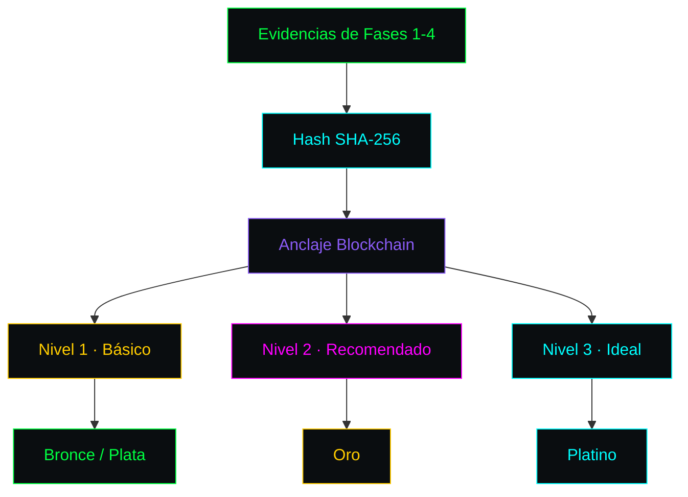

<!-- ═══════════════════════════════════════════════════════════════════════ -->
<!-- SCDR-001 · CRITERIOS POR FASE CREATIVA · v1.0 · HACKER PRO            -->
<!-- ═══════════════════════════════════════════════════════════════════════ -->

```text
╔══════════════════════════════════════════════════════════════════════════════╗
║ ▓▓▓▓▓▓▓▓▓▓▓▓▓▓▓▓▓▓▓▓▓▓▓▓▓▓▓▓▓▓▓▓▓▓▓▓▓▓▓▓▓▓▓▓▓▓▓▓▓▓▓▓▓▓▓▓▓▓▓▓▓▓▓▓▓▓▓▓▓▓▓▓▓▓▓▓ ║
║ ▓                                                                          ▓ ║
║ ▓   ██████╗██████╗ ██╗████████╗███████╗██████╗ ██╗ ██████╗ ███████╗        ▓ ║
║ ▓   ██╔════╝██╔══██╗██║╚══██╔══╝██╔════╝██╔══██╗██║██╔═══██╗██╔════╝        ▓ ║
║ ▓   ██║     ██████╔╝██║   ██║   █████╗  ██████╔╝██║██║   ██║███████╗        ▓ ║
║ ▓   ██║     ██╔══██╗██║   ██║   ██╔══╝  ██╔══██╗██║██║   ██║╚════██║        ▓ ║
║ ▓   ╚██████╗██║  ██║██║   ██║   ███████╗██║  ██║██║╚██████╔╝███████║        ▓ ║
║ ▓    ╚═════╝╚═╝  ╚═╝╚═╝   ╚═╝   ╚══════╝╚═╝  ╚═╝╚═╝ ╚═════╝ ╚══════╝        ▓ ║
║ ▓                                                                          ▓ ║
║ ▓   ━━━━━━━━━━━━━━━━━━━━━━━━━━━━━━━━━━━━━━━━━━━━━━━━━━━━━━━━━━━━━━━━━━━   ▓ ║
║ ▓   C R I T E R I O S   P O R   F A S E   C R E A T I V A                 ▓ ║
║ ▓   ━━━━━━━━━━━━━━━━━━━━━━━━━━━━━━━━━━━━━━━━━━━━━━━━━━━━━━━━━━━━━━━━━━━   ▓ ║
║ ▓   Documento Fundacional 2 · v1.0 · 14 Septiembre 2026                   ▓ ║
║ ▓                                                                          ▓ ║
║ ▓▓▓▓▓▓▓▓▓▓▓▓▓▓▓▓▓▓▓▓▓▓▓▓▓▓▓▓▓▓▓▓▓▓▓▓▓▓▓▓▓▓▓▓▓▓▓▓▓▓▓▓▓▓▓▓▓▓▓▓▓▓▓▓▓▓▓▓▓▓▓▓▓▓▓▓ ║
╚══════════════════════════════════════════════════════════════════════════════╝
```

**Catálogo de acciones válidas, bonos técnicos y evidencia documental por fase.**

---

```text
┌─[ 01 ]─────────────────────────────────────── FASE 1 · CONCEPTO (30%) ─┐
│                                                                        │
└────────────────────────────────────────────────────────────────────────┘
```

```text
        ┌──────────────────────────────────────────┐
        │  ▓ FASE 1 · CONCEPTO                     │
        │  Peso: 30%                               │
        │  Foco: Origen intelectual                │
        └──────────────────┬───────────────────────┘
                           │
                           ▼
        ┌──────────────────────────────────────────┐
        │  Catálogo de Acciones Validadas          │
        └──────────────────────────────────────────┘
```

| Acción | UDC |
|:---|:---:|
| Concepto original (inédito, desarrollado) | **100 pts** |
| Concepto derivado (inspirado en estilos) | **60 pts** |
| Concepto genérico (arquetipos comunes) | **20 pts** |
| Dirección específica (estructura/guion) | **80 pts** |
| Dirección genérica (instrucciones básicas) | **30 pts** |

**📎 Evidencia Obligatoria (Nivel 1):** Documento conceptual inicial o mapa mental (PDF/TXT) redactado previamente al uso de la IA, firmado digitalmente.

---

```text
┌─[ 02 ]─────────────────────────────────────── FASE 2 · DIRECCIÓN (20%) ─┐
│                                                                         │
└─────────────────────────────────────────────────────────────────────────┘
```

```text
        ┌──────────────────────────────────────────┐
        │  ▓ FASE 2 · DIRECCIÓN                    │
        │  Peso: 20%                               │
        │  Foco: Control sobre la IA               │
        └──────────────────┬───────────────────────┘
                           │
                           ▼
```

| Acción | UDC |
|:---|:---:|
| Prompt inicial complejo (+100 chars con contexto, estilo, restricciones) | **10 pts** |
| Prompt iterativo / Refinamiento (máximo 20 iteraciones) | **5 pts c/u** |

**📎 Evidencia Obligatoria (Nivel 1):** Log histórico inalterado de prompts (JSON/TXT).

---

```text
┌─[ 03 ]─────────────────────────── FASE 3 · PRODUCCIÓN (30% + BONOS) ─┐
│                                                                       │
└───────────────────────────────────────────────────────────────────────┘
```

```text
        ┌──────────────────────────────────────────┐
        │  ▓ FASE 3 · PRODUCCIÓN                   │
        │  Peso: 30% + BAT                         │
        │  Foco: Procesamiento IA                  │
        └──────────────────┬───────────────────────┘
                           │
                           ▼
```

| Acción IA | UDC |
|:---|:---:|
| Generación IA Base | **1 pt** |
| Variación IA (por lote) | **0.5 pts** |
| Upscaling / Optimización IA | **0.5 pts** |

**Sistema BAT (Bonus Aditivos Técnicos):**

```text
  Uso herramienta estándar   ░░░░░░░░░░░░░░░░░░░░░░░░░░░░░░░░░░░░  +0%
  Integración multi-modelo   ████░░░░░░░░░░░░░░░░░░░░░░░░░░░░░░░░  +5%
  Modelo local / Open Source ████░░░░░░░░░░░░░░░░░░░░░░░░░░░░░░░░  +5%
  Fine-tuning con datos      ████████░░░░░░░░░░░░░░░░░░░░░░░░░░░░  +10%
  Entrenamiento from scratch ████████████████░░░░░░░░░░░░░░░░░░░░  +20%
```

---

```text
┌─[ 04 ]───────────────────────────────── FASE 4 · EDICIÓN/CURACIÓN (20%) ─┐
│                                                                          │
└──────────────────────────────────────────────────────────────────────────┘
```

```text
        ┌──────────────────────────────────────────┐
        │  ▓ FASE 4 · EDICIÓN / CURACIÓN           │
        │  Peso: 20%                               │
        │  Foco: Artesanía final                   │
        └──────────────────┬───────────────────────┘
                           │
                           ▼
```

| Acción | UDC |
|:---|:---:|
| Curación compleja (+100 opciones filtradas) | **50 pts** |
| Curación media (20-100 opciones) | **30 pts** |
| Curación simple (-20 opciones) | **10 pts** |
| Selección aleatoria | **0 pts** |
| Edición manual / Post-proceso (hora, máx 10) | **20 pts** |

---

```text
┌─[ 05 ]─────────────────────────────────── MATRIZ GLOBAL DE EVIDENCIA ─┐
│                                                                       │
└───────────────────────────────────────────────────────────────────────┘
```



| Nivel | Requisitos | Certificaciones |
|:---:|:---|:---|
| **Nivel 1** | Capturas con timestamp, log de prompts, 3 versiones intermedias, declaración jurada | 🥉 Bronce, 🥈 Plata |
| **Nivel 2** | Nivel 1 + archivo nativo con capas, video 10 min, historial Git, metadatos EXIF | 🥇 Oro |
| **Nivel 3** | Nivel 2 + grabación 4K sin cortes, bitácora de decisiones, testimonios | 💎 Platino |

---

```text
╔══════════════════════════════════════════════════════════════════════════════╗
║ ▓▓▓▓▓▓▓▓▓▓▓▓▓▓▓▓▓▓▓▓▓▓▓▓▓▓▓▓▓▓▓▓▓▓▓▓▓▓▓▓▓▓▓▓▓▓▓▓▓▓▓▓▓▓▓▓▓▓▓▓▓▓▓▓▓▓▓▓▓▓▓▓▓▓▓▓ ║
║ ▓                                                                          ▓ ║
║ ▓   [ SCDR-001 · CRITERIOS POR FASE · v1.0 ]                             ▓ ║
║ ▓                                                                          ▓ ║
║ ▓   ▸ Fase 1: Concepto · 30%                                              ▓ ║
║ ▓   ▸ Fase 2: Dirección · 20%                                             ▓ ║
║ ▓   ▸ Fase 3: Producción · 30% + BAT                                      ▓ ║
║ ▓   ▸ Fase 4: Edición · 20%                                               ▓ ║
║ ▓   ▸ Evidencia: 3 niveles                                                ▓ ║
║ ▓                                                                          ▓ ║
║ ▓   root@scdr-001:~# ./verify --criterios                                 ▓ ║
║ ▓   [████████████████████████████████████████] 100%                       ▓ ║
║ ▓   ✓ 4 fases documentadas                                                ▓ ║
║ ▓   ✓ BAT aplicado                                                        ▓ ║
║ ▓   ✓ Evidencia clasificada                                               ▓ ║
║ ▓                                                                          ▓ ║
║ ▓   root@scdr-001:~# _                                                     ▓ ║
║ ▓                                                                          ▓ ║
║ ▓▓▓▓▓▓▓▓▓▓▓▓▓▓▓▓▓▓▓▓▓▓▓▓▓▓▓▓▓▓▓▓▓▓▓▓▓▓▓▓▓▓▓▓▓▓▓▓▓▓▓▓▓▓▓▓▓▓▓▓▓▓▓▓▓▓▓▓▓▓▓▓▓▓▓▓ ║
╚══════════════════════════════════════════════════════════════════════════════╝
```

<!-- FIN DEL DOCUMENTO · SCDR-001 · CRITERIOS · v1.0 -->
