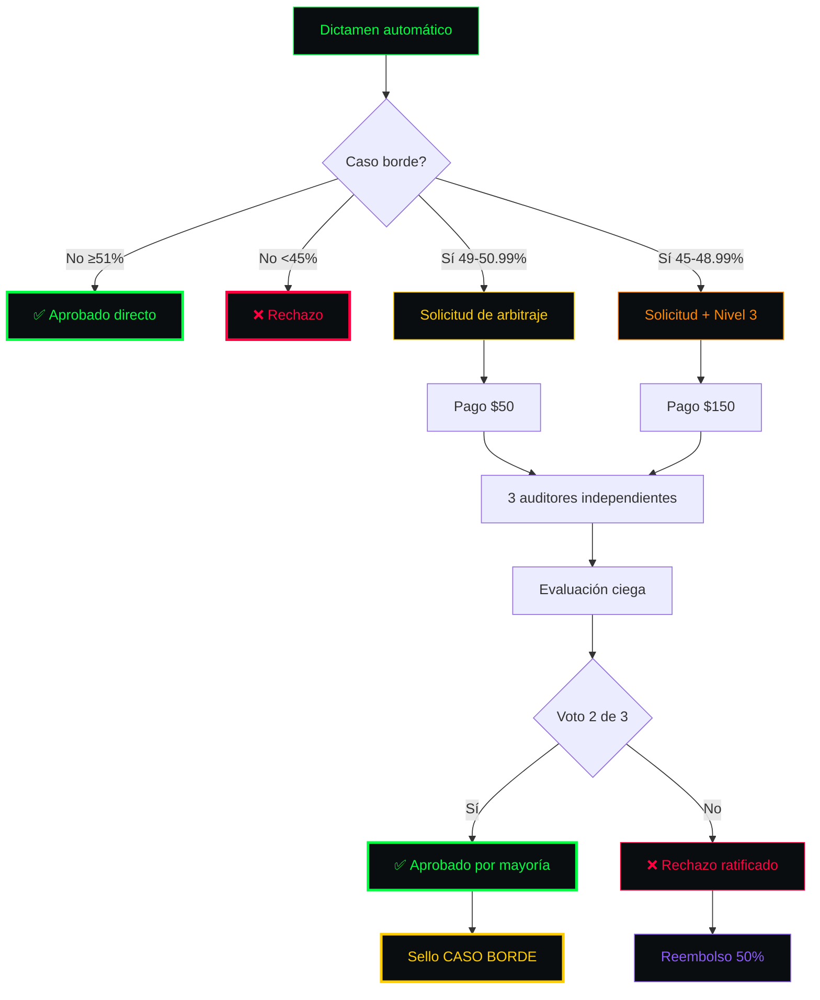

<!-- ═══════════════════════════════════════════════════════════════════════ -->
<!-- SCDR-001 · PONDERACIÓN Y CASOS LÍMITE · v1.0 · HACKER PRO              -->
<!-- ═══════════════════════════════════════════════════════════════════════ -->

```text
╔══════════════════════════════════════════════════════════════════════════════╗
║ ▓▓▓▓▓▓▓▓▓▓▓▓▓▓▓▓▓▓▓▓▓▓▓▓▓▓▓▓▓▓▓▓▓▓▓▓▓▓▓▓▓▓▓▓▓▓▓▓▓▓▓▓▓▓▓▓▓▓▓▓▓▓▓▓▓▓▓▓▓▓▓▓▓▓▓▓ ║
║ ▓                                                                          ▓ ║
║ ▓   ██████╗  ██████╗ ███╗   ██╗██████╗ ███████╗██████╗  █████╗            ▓ ║
║ ▓   ██╔══██╗██╔═══██╗████╗  ██║██╔══██╗██╔════╝██╔══██╗██╔══██╗           ▓ ║
║ ▓   ██████╔╝██║   ██║██╔██╗ ██║██║  ██║█████╗  ██████╔╝███████║           ▓ ║
║ ▓   ██╔═══╝ ██║   ██║██║╚██╗██║██║  ██║██╔══╝  ██╔══██╗██╔══██║           ▓ ║
║ ▓   ██║     ╚██████╔╝██║ ╚████║██████╔╝███████╗██║  ██║██║  ██║           ▓ ║
║ ▓   ╚═╝      ╚═════╝ ╚═╝  ╚═══╝╚═════╝ ╚══════╝╚═╝  ╚═╝╚═╝  ╚═╝           ▓ ║
║ ▓                                                                          ▓ ║
║ ▓   ━━━━━━━━━━━━━━━━━━━━━━━━━━━━━━━━━━━━━━━━━━━━━━━━━━━━━━━━━━━━━━━━━━━   ▓ ║
║ ▓   P O N D E R A C I Ó N   Y   C A S O S   L Í M I T E                    ▓ ║
║ ▓   ━━━━━━━━━━━━━━━━━━━━━━━━━━━━━━━━━━━━━━━━━━━━━━━━━━━━━━━━━━━━━━━━━━━   ▓ ║
║ ▓   Documento Fundacional 3 · v1.0 · 14 Septiembre 2026                   ▓ ║
║ ▓                                                                          ▓ ║
║ ▓▓▓▓▓▓▓▓▓▓▓▓▓▓▓▓▓▓▓▓▓▓▓▓▓▓▓▓▓▓▓▓▓▓▓▓▓▓▓▓▓▓▓▓▓▓▓▓▓▓▓▓▓▓▓▓▓▓▓▓▓▓▓▓▓▓▓▓▓▓▓▓▓▓▓▓ ║
╚══════════════════════════════════════════════════════════════════════════════╝
```

**Tabla maestra de ponderación, matriz de decisión y sistema de arbitraje.**

---

```text
┌─[ 01 ]─────────────────────────────── MATRIZ DE PESOS CONSOLIDADOS ─┐
│                                                                      │
└──────────────────────────────────────────────────────────────────────┘
```

```text
┌──────────────────────────────────────────────────────────────────────────┐
│                                                                          │
│  ▓ F1 · CONCEPTO           ████████████████████░░░░░░░░░░░░░░░  30%     │
│  ▓ F2 · DIRECCIÓN          ██████████████░░░░░░░░░░░░░░░░░░░░░░  20%     │
│  ▓ F3 · PRODUCCIÓN         ████████████████████░░░░░░░░░░░░░░░  30%     │
│  ▓ F4 · EDICIÓN            ██████████████░░░░░░░░░░░░░░░░░░░░░░  20%     │
│                                                                          │
│  ▓ TOTAL                   ████████████████████████████████████ 100%    │
│                                                                          │
└──────────────────────────────────────────────────────────────────────────┘
```

---

```text
┌─[ 02 ]─────────────────────────────────── MATRIZ DE DECISIÓN ─┐
│                                                                │
└────────────────────────────────────────────────────────────────┘
```

| %AH | Clasificación | Acción | Tarifa |
|:---:|:---|:---|:---:|
| 🟢 ≥ 51.00% | Aprobado Directo | Emisión inmediata | Estándar |
| 🟡 49.00% - 50.99% | Caso Borde A | Arbitraje Nivel 1 | **+$50 USD** |
| 🟠 45.00% - 48.99% | Caso Borde B | Arbitraje Nivel 3 | **+$150 USD** |
| 🔴 < 45.00% | Rechazo Inmediato | No arbitrable | N/A |

---

```text
┌─[ 03 ]─────────────────────────── SISTEMA DE ARBITRAJE (FLUJO) ─┐
│                                                                  │
└──────────────────────────────────────────────────────────────────┘
```



---

```text
┌─[ 04 ]───────────────────────── SELLO ESPECIAL CASO BORDE ─┐
│                                                             │
└─────────────────────────────────────────────────────────────┘
```

```text
╔══════════════════════════════════════════════════════════════════════════╗
║                                                                          ║
║   ⚠️  CERTIFICACIÓN BAJO ARBITRAJE                                       ║
║                                                                          ║
║   %AH Final:            [XX.XX%]                                         ║
║   Veredicto:            APROBADO POR MAYORÍA (2 de 3)                    ║
║   Auditores:            [Nombre 1] · [Nombre 2] · [Nombre 3]            ║
║   Fecha del arbitraje:  [DD/MM/AAAA]                                     ║
║   Timestamp:            [YYYY-MM-DDTHH:MM:SSZ]                           ║
║                                                                          ║
║   Este certificado fue aprobado mediante arbitraje por encontrarse       ║
║   en el límite del umbral del 51%.                                       ║
║                                                                          ║
╚══════════════════════════════════════════════════════════════════════════╝
```

---

```text
┌─[ 05 ]─────────────────────────── CONSECUENCIAS POR FRAUDE ─┐
│                                                              │
└──────────────────────────────────────────────────────────────┘
```

| Infracción | Sanción | Impacto |
|:---|:---|:---:|
| Falsificación de logs o prompts | Anulación inmediata | 🔴 |
| Manipulación de metadatos | Veto permanente | 🔴 |
| Simulación de horas de edición | Pérdida del 100% de tarifas | 🔴 |
| Fraude reincidente | Lista Negra Criptográfica | 🔴🔴 |
| Reclamación fraudulenta | Acción legal | 🔴🔴🔴 |

---

```text
┌─[ 06 ]─────────────────────────── CASOS LÍMITE EJEMPLO ─┐
│                                                          │
└──────────────────────────────────────────────────────────┘
```

### 🎚️ Caso Borde 1: Ensayo Literario (50.15% AH)

```text
        DICTAMEN AUTOMÁTICO
              │
              ▼
        Caso Borde Tipo A
              │
              ▼
        Pago $50 USD
              │
              ▼
        3 Auditores
              │
              ▼
        Evidencia Nivel 1
              │
              ▼
        Voto: 2/3 APROBADO
              │
              ▼
        ✅ Sello CASO BORDE
```

### 🎚️ Caso Borde 2: Cortometraje (46.80% AH)

```text
        DICTAMEN AUTOMÁTICO
              │
              ▼
        Caso Borde Tipo B
              │
              ▼
        Solo Evidencia Nivel 1
              │
              ▼
        ❌ BLOQUEADO
              │
              ▼
        Rechazo permanente
```

---

```text
╔══════════════════════════════════════════════════════════════════════════════╗
║ ▓▓▓▓▓▓▓▓▓▓▓▓▓▓▓▓▓▓▓▓▓▓▓▓▓▓▓▓▓▓▓▓▓▓▓▓▓▓▓▓▓▓▓▓▓▓▓▓▓▓▓▓▓▓▓▓▓▓▓▓▓▓▓▓▓▓▓▓▓▓▓▓▓▓▓▓ ║
║ ▓                                                                          ▓ ║
║ ▓   [ SCDR-001 · PONDERACIÓN Y CASOS LÍMITE · v1.0 ]                      ▓ ║
║ ▓                                                                          ▓ ║
║ ▓   ▸ Pesos: 30/20/30/20                                                  ▓ ║
║ ▓   ▸ Arbitraje: 3 niveles                                                ▓ ║
║ ▸ Fraude: 5 sanciones                                                     ▓ ║
║ ▓   ▸ Sello: CASO BORDE                                                   ▓ ║
║ ▓                                                                          ▓ ║
║ ▓   root@scdr-001:~# ./verify --ponderacion                               ▓ ║
║ ▓   [████████████████████████████████████████] 100%                       ▓ ║
║ ▓   ✓ Matriz blindada                                                     ▓ ║
║ ▓   ✓ Arbitraje operativo                                                 ▓ ║
║ ▓   ✓ Sanciones definidas                                                 ▓ ║
║ ▓                                                                          ▓ ║
║ ▓   root@scdr-001:~# _                                                     ▓ ║
║ ▓                                                                          ▓ ║
║ ▓▓▓▓▓▓▓▓▓▓▓▓▓▓▓▓▓▓▓▓▓▓▓▓▓▓▓▓▓▓▓▓▓▓▓▓▓▓▓▓▓▓▓▓▓▓▓▓▓▓▓▓▓▓▓▓▓▓▓▓▓▓▓▓▓▓▓▓▓▓▓▓▓▓▓▓ ║
╚══════════════════════════════════════════════════════════════════════════════╝
```

<!-- FIN DEL DOCUMENTO · SCDR-001 · PONDERACIÓN · v1.0 -->
