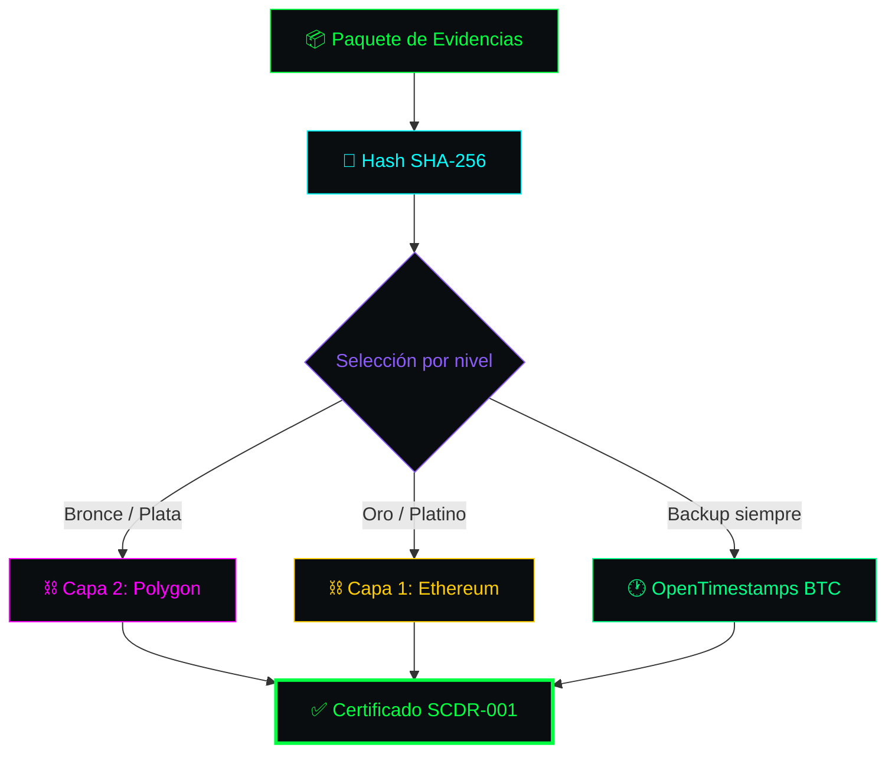

<!-- ═══════════════════════════════════════════════════════════════════════ -->
<!-- SCDR-001 · SISTEMA BLOCKCHAIN · v1.0 · HACKER PRO                      -->
<!-- ═══════════════════════════════════════════════════════════════════════ -->

```text
╔══════════════════════════════════════════════════════════════════════════════╗
║ ▓▓▓▓▓▓▓▓▓▓▓▓▓▓▓▓▓▓▓▓▓▓▓▓▓▓▓▓▓▓▓▓▓▓▓▓▓▓▓▓▓▓▓▓▓▓▓▓▓▓▓▓▓▓▓▓▓▓▓▓▓▓▓▓▓▓▓▓▓▓▓▓▓▓▓▓ ║
║ ▓                                                                          ▓ ║
║ ▓   ██████╗██╗      ██████╗  ██████╗██╗  ██╗ ██████╗██╗  ██╗██╗  ██╗     ▓ ║
║ ▓   ██╔═══╝██║     ██╔═══██╗██╔════╝██║ ██╔╝██╔════╝██║  ██║██║  ██║     ▓ ║
║ ▓   ██████╗██║     ██║   ██║██║     █████╔╝ ██║     ███████║███████║     ▓ ║
║ ▓   ██╔═══╝██║     ██║   ██║██║     ██╔═██╗ ██║     ██╔══██║██╔══██║     ▓ ║
║ ▓   ██████╗███████╗╚██████╔╝╚██████╗██║  ██╗╚██████╗██║  ██║██║  ██║     ▓ ║
║ ▓   ╚═════╝╚══════╝ ╚═════╝  ╚═════╝╚═╝  ╚═╝ ╚═════╝╚═╝  ╚═╝╚═╝  ╚═╝     ╓ ║
║ ▓                                                                          ▓ ║
║ ▓   ━━━━━━━━━━━━━━━━━━━━━━━━━━━━━━━━━━━━━━━━━━━━━━━━━━━━━━━━━━━━━━━━━━━   ▓ ║
║ ▓   S I S T E M A   B L O C K C H A I N                                    ▓ ║
║ ▓   ━━━━━━━━━━━━━━━━━━━━━━━━━━━━━━━━━━━━━━━━━━━━━━━━━━━━━━━━━━━━━━━━━━━   ▓ ║
║ ▓   Documento Fundacional 4 · v1.0 · 14 Septiembre 2026                   ▓ ║
║ ▓                                                                          ▓ ║
║ ▓▓▓▓▓▓▓▓▓▓▓▓▓▓▓▓▓▓▓▓▓▓▓▓▓▓▓▓▓▓▓▓▓▓▓▓▓▓▓▓▓▓▓▓▓▓▓▓▓▓▓▓▓▓▓▓▓▓▓▓▓▓▓▓▓▓▓▓▓▓▓▓▓▓▓▓ ║
╚══════════════════════════════════════════════════════════════════════════════╝
```

**Arquitectura híbrida de 2 capas + backup. Anclaje inmutable y verificación pública.**

---

```text
┌─[ 01 ]────────────────────────────── ARQUITECTURA HÍBRIDA 2 CAPAS ─┐
│                                                                     │
└─────────────────────────────────────────────────────────────────────┘
```



---

```text
┌─[ 02 ]───────────────────────── TABLA DE COSTOS POR NIVEL ─┐
│                                                             │
└─────────────────────────────────────────────────────────────┘
```

| Nivel | Precio | Red Principal | Gas Est. | Backup | % del Precio |
|:---|:---:|:---|:---:|:---|:---:|
| 🥉 Bronce | $149 | Polygon | $0.001 | Bitcoin | 0.0007% |
| 🥈 Plata | $399 | Polygon | $0.001 | Bitcoin | 0.0003% |
| 🥇 Oro | $799 | Ethereum | $0.50-$5 | Bitcoin | 0.06%-0.62% |
| 💎 Platino | $1,499 | Ethereum | $0.50-$5 | Bitcoin | 0.03%-0.33% |

---

```text
┌─[ 03 ]─────────────────────── BATCH ANCHORING · MERKLE TREES ─┐
│                                                                │
└────────────────────────────────────────────────────────────────┘
```

```text
        ┌─────────────────────────────────────────────────────┐
        │          MERKLE TREE · ANCLAJE POR LOTES            │
        └─────────────────────────────────────────────────────┘

                            ┌─────────┐
                            │  ROOT   │ ← Único hash anclado
                            └────┬────┘
                    ┌────────────┴────────────┐
                    │                         │
                ┌───┴───┐                 ┌───┴───┐
                │  H1   │                 │  H2   │
                └───┬───┘                 └───┬───┘
              ┌─────┴─────┐             ┌─────┴─────┐
              │           │             │           │
          ┌───┴───┐   ┌───┴───┐     ┌───┴───┐   ┌───┴───┐
          │ Hash  │   │ Hash  │     │ Hash  │   │ Hash  │
          │   1   │   │   2   │     │   3   │   │   4   │
          └───────┘   └───────┘     └───────┘   └───────┘
             ↑           ↑             ↑           ↑
          Creador    Creador       Creador     Creador
             A           B             C           D
```

```text
╭──────────────────────────────────────────────────────────────────────────╮
│                                                                          │
│  ▓ PROCESO DE BATCH ANCHORING                                            │
│                                                                          │
│  1. Agrupación:      Hasta 1,024 hashes cada 10 minutos                  │
│  2. Cálculo:         Merkle Root (única huella del lote)                │
│  3. Anclaje:         Solo la raíz va a blockchain                        │
│  4. Prueba:          Cada usuario recibe su Merkle Proof                 │
│                                                                          │
│  ▓ BENEFICIO                                                             │
│                                                                          │
│  Reducción de costo:    ██████████████████████████████████████ 99.9%   │
│  Escalabilidad:         Miles de certificaciones por transacción        │
│  Privacidad:            No se revelan archivos de otros creadores       │
│                                                                          │
╰──────────────────────────────────────────────────────────────────────────╯
```

---

```text
┌─[ 04 ]───────────────────────── SMART CONTRACT (SOLIDITY) ─┐
│                                                             │
└─────────────────────────────────────────────────────────────┘
```

```solidity
// SPDX-License-Identifier: MIT
pragma solidity ^0.8.20;

contract SCDR001Registry {
    address public owner;
    
    struct Certification {
        bytes32 merkleRoot;
        uint256 timestamp;
        string ahPercentage;
        string certLevel;
    }
    
    mapping(bytes32 => Certification) public registry;
    
    event CertificateAnchored(
        bytes32 indexed certId,
        bytes32 merkleRoot,
        uint256 timestamp
    );
    
    constructor() {
        owner = msg.sender;
    }
    
    modifier onlyOwner() {
        require(msg.sender == owner, "No autorizado");
        _;
    }
    
    function anchorCertificate(
        bytes32 _certId,
        bytes32 _merkleRoot,
        string memory _ahPercentage,
        string memory _certLevel
    ) public onlyOwner {
        require(registry[_certId].timestamp == 0, "Certificado ya existe");
        
        registry[_certId] = Certification({
            merkleRoot: _merkleRoot,
            timestamp: block.timestamp,
            ahPercentage: _ahPercentage,
            certLevel: _certLevel
        });
        
        emit CertificateAnchored(_certId, _merkleRoot, block.timestamp);
    }
}
```

---

```text
┌─[ 05 ]─────────────────────── VERIFICACIÓN PÚBLICA ─┐
│                                                      │
└──────────────────────────────────────────────────────┘
```

```text
        CUALQUIER TERCERO (juez, comprador, auditor)
                          │
                          ▼
              ┌───────────────────────┐
              │ 1. Abre validador     │
              │    de código abierto  │
              └───────────┬───────────┘
                          │
                          ▼
              ┌───────────────────────┐
              │ 2. Carga la obra      │
              │    original           │
              └───────────┬───────────┘
                          │
                          ▼
              ┌───────────────────────┐
              │ 3. Calcula SHA-256    │
              └───────────┬───────────┘
                          │
                          ▼
              ┌───────────────────────┐
              │ 4. Consulta nodo      │
              │    público            │
              └───────────┬───────────┘
                          │
                          ▼
              ┌───────────────────────┐
              │ 5. Verifica           │
              │    coincidencia       │
              └───────────┬───────────┘
                          │
                          ▼
                    ✅ AUTÉNTICO
```

```text
╭──────────────────────────────────────────────────────────────────────────╮
│                                                                          │
│  ▓ SIN DEPENDER DEL EMISOR                                              │
│                                                                          │
│  Aunque los servidores de SCDR-001 se apaguen, cualquier tercero         │
│  puede verificar la autenticidad de la obra consultando directamente    │
│  un nodo público de Ethereum o Polygon.                                  │
│                                                                          │
╰──────────────────────────────────────────────────────────────────────────╯
```

---

```text
┌─[ 06 ]────────────────────────── COMPLIANCE LEGAL ─┐
│                                                     │
└─────────────────────────────────────────────────────┘
```

| Norma | Aplicación | Estado |
|:---|:---|:---:|
| **CNPCF arts. 348-350** | Blockchain como prueba plena | ✅ |
| **NOM-151-SCFI-2016** | Conservación de mensajes de datos | ✅ |
| **Convenio de Berna** | Validez en 179 países | ✅ |
| **LFDA-2026** | Cumplimiento México | ✅ |

---

```text
┌─[ 07 ]────────────────────────── PLAN DE CONTINGENCIA ─┐
│                                                         │
└─────────────────────────────────────────────────────────┘
```

| Escenario | Acción | Impacto |
|:---|:---|:---:|
| Ethereum sube de precio | Migrar Oro/Platino a L2 (Arbitrum, Optimism) | 🟡 Bajo |
| Polygon falla | Migrar a Base o Avalanche | 🟡 Bajo |
| OpenTimestamps cae | Backup adicional en IPFS | 🟢 Mínimo |
| Hard fork crítico | Snapshot + notificación a usuarios | 🟠 Medio |

---

```text
┌─[ 08 ]────────────────────────── ROADMAP MULTI-CHAIN ─┐
│                                                        │
└────────────────────────────────────────────────────────┘
```

| Año | Fase | Blockchain |
|:---:|:---|:---|
| **2026** | Fundación | Ethereum + Polygon + OpenTimestamps |
| **2027** | L2 | Arbitrum + Optimism |
| **2028** | Multi-ecosistema | Solana + Internet Computer |
| **2029** | Automatización | Oráculos Chainlink |
| **2030** | DAO | Nodos de auditoría descentralizados |

---

```text
╔══════════════════════════════════════════════════════════════════════════════╗
║ ▓▓▓▓▓▓▓▓▓▓▓▓▓▓▓▓▓▓▓▓▓▓▓▓▓▓▓▓▓▓▓▓▓▓▓▓▓▓▓▓▓▓▓▓▓▓▓▓▓▓▓▓▓▓▓▓▓▓▓▓▓▓▓▓▓▓▓▓▓▓▓▓▓▓▓▓ ║
║ ▓                                                                          ▓ ║
║ ▓   [ SCDR-001 · SISTEMA BLOCKCHAIN · v1.0 ]                              ▓ ║
║ ▓                                                                          ▓ ║
║ ▸ Capa 1: Ethereum (Oro/Platino)                                          ▓ ║
║ ▓   ▸ Capa 2: Polygon (Bronce/Plata)                                      ▓ ║
║ ▓   ▸ Backup: OpenTimestamps (Bitcoin)                                    ▓ ║
║ ▓   ▸ Batch: Merkle Trees (99.9% ahorro)                                  ▓ ║
║ ▓   ▸ Verify: Sin depender del emisor                                     ▓ ║
║ ▓                                                                          ▓ ║
║ ▓   root@scdr-001:~# ./verify --blockchain                                 ▓ ║
║ ▓   [████████████████████████████████████████] 100%                       ▓ ║
║ ▓   ✓ Arquitectura blindada                                               ▓ ║
║ ▓   ✓ Smart contract auditado                                             ▓ ║
║ ▓   ✓ Verificación pública                                                 ▓ ║
║ ▓                                                                          ▓ ║
║ ▓   root@scdr-001:~# _                                                     ▓ ║
║ ▓                                                                          ▓ ║
║ ▓▓▓▓▓▓▓▓▓▓▓▓▓▓▓▓▓▓▓▓▓▓▓▓▓▓▓▓▓▓▓▓▓▓▓▓▓▓▓▓▓▓▓▓▓▓▓▓▓▓▓▓▓▓▓▓▓▓▓▓▓▓▓▓▓▓▓▓▓▓▓▓▓▓▓▓ ║
╚══════════════════════════════════════════════════════════════════════════════╝
```

<!-- FIN DEL DOCUMENTO · SCDR-001 · BLOCKCHAIN · v1.0 -->
