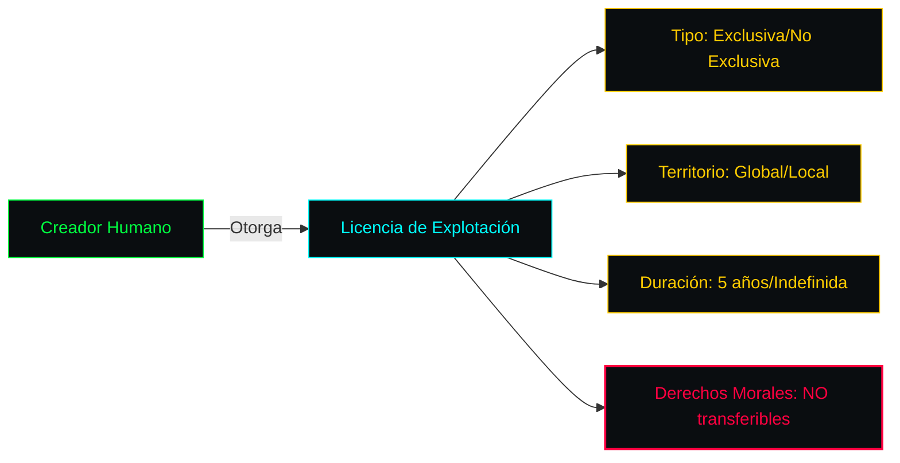

<!-- ═══════════════════════════════════════════════════════════════════════ -->
<!-- SCDR-001 · LICENCIA COMERCIAL · v1.0 · HACKER PRO                      -->
<!-- ═══════════════════════════════════════════════════════════════════════ -->

```text
╔══════════════════════════════════════════════════════════════════════════════╗
║ ▓▓▓▓▓▓▓▓▓▓▓▓▓▓▓▓▓▓▓▓▓▓▓▓▓▓▓▓▓▓▓▓▓▓▓▓▓▓▓▓▓▓▓▓▓▓▓▓▓▓▓▓▓▓▓▓▓▓▓▓▓▓▓▓▓▓▓▓▓▓▓▓▓▓▓▓ ║
║ ▓                                                                          ▓ ║
║ ▓   ██╗     ██╗ ██████╗███████╗███╗   ██╗ ██████╗██╗ █████╗              ▓ ║
║ ▓   ██║     ██║██╔════╝██╔════╝████╗  ██║██╔════╝██║██╔══██╗             ▓ ║
║ ▓   ██║     ██║██║     █████╗  ██╔██╗ ██║██║     ██║███████║             ▓ ║
║ ▓   ██║     ██║██║     ██╔══╝  ██║╚██╗██║██║     ██║██╔══██║             ▓ ║
║ ▓   ███████╗██║╚██████╗███████╗██║ ╚████║╚██████╗██║██║  ██║             ▓ ║
║ ▓   ╚══════╝╚═╝ ╚═════╝╚══════╝╚═╝  ╚═══╝ ╚═════╝╚═╝╚═╝  ╚═╝             ▓ ║
║ ▓                                                                          ▓ ║
║ ▓   ━━━━━━━━━━━━━━━━━━━━━━━━━━━━━━━━━━━━━━━━━━━━━━━━━━━━━━━━━━━━━━━━━━━   ▓ ║
║ ▓   C O M M E R C I A L   ·   S C D R - 0 0 1                              ▓ ║
║ ▓   ━━━━━━━━━━━━━━━━━━━━━━━━━━━━━━━━━━━━━━━━━━━━━━━━━━━━━━━━━━━━━━━━━━━   ▓ ║
║ ▓   Licencia Comercial · v1.0 · Bilingüe                                  ▓ ║
║ ▓                                                                          ▓ ║
║ ▓▓▓▓▓▓▓▓▓▓▓▓▓▓▓▓▓▓▓▓▓▓▓▓▓▓▓▓▓▓▓▓▓▓▓▓▓▓▓▓▓▓▓▓▓▓▓▓▓▓▓▓▓▓▓▓▓▓▓▓▓▓▓▓▓▓▓▓▓▓▓▓▓▓▓▓ ║
╚══════════════════════════════════════════════════════════════════════════════╝
```

**Contrato de licencia para comercialización de obras simbióticas Humano-IA.**

```text
┌──────────────────────────────────────────────────────────────────────────────┐
│  [ PARTES ]  Creador + Licenciatario   [ TIPO  ]  Exclusiva / No Exclusiva  │
│  [ REGALÍAS] Primera venta + reventa    [ DROIT ]  Derecho de participación │
│  [ LEGAL  ]  LFDA + Berna + CNPCF       [ AUDIT ]  Hash + Timestamp         │
└──────────────────────────────────────────────────────────────────────────────┘
```


```text
╔══════════════════════════════════════════════════════════════════════════════╗
║  ⚠  DISCLAIMER LEGAL                                                         ║
╠══════════════════════════════════════════════════════════════════════════════╣
║                                                                              ║
║  Este documento constituye un MODELO de licencia comercial privada.          ║
║                                                                              ║
║  ▸ Su uso es responsabilidad exclusiva de las partes.                       ║
║  ▸ El Movimiento SCDR-001 no presta servicios legales.                      ║
║  ▸ No sustituye la asesoría jurídica personalizada.                         ║
║  ▸ No garantiza un resultado favorable en litigio judicial.                 ║
║                                                                              ║
║  Para asuntos legales específicos, consulte a un abogado titulado.          ║
║                                                                              ║
╚══════════════════════════════════════════════════════════════════════════════╝
```

---

## 📖 PARTE I — PREÁMBULO Y DECLARACIONES

```text
╭──────────────────────────────────────────────────────────────────────────╮
│                                                                          │
│  Conste por el presente documento el Contrato de Licencia Comercial      │
│  de Obra Simbiótica (en adelante, "la Licencia"), celebrado por una      │
│  parte por el CREADOR HUMANO (Anexo A) y por la otra el LICENCIATARIO    │
│  (adquirente legítimo de los derechos comerciales).                      │
│                                                                          │
╰──────────────────────────────────────────────────────────────────────────╯
```

**CONSIDERANDO:**

1. Que la Obra objeto de este contrato ha sido desarrollada bajo el **Estándar SCDR-001**, siendo resultado de una colaboración simbiótica entre el Creador Humano y sistemas de IA.
2. Que el proceso creativo ha sido auditado mediante el sistema **UDC**, garantizando participación humana ≥ 51%.
3. Que el paquete probatorio ha sido anclado en **blockchain** mediante hashes criptográficos.

---

## 📖 PARTE II — DEFINICIONES

| Término | Definición |
|:---|:---|
| **Obra Simbiótica** | Creación híbrida con autoría dividida entre humano e IA |
| **%AH** | Porcentaje exacto de atribución humana (Documento 1) |
| **Anclaje Criptográfico** | Registro público e inalterable del hash SHA-256 |
| **Droit de Suite** | Derecho de participación en reventas |

---

## 📖 PARTE III — DECLARACIÓN OBLIGATORIA DE COAUTORÍA

```text
╔══════════════════════════════════════════════════════════════════════════════╗
║                                                                              ║
║   El Creador Humano declara bajo protesta de decir verdad que la Obra       ║
║   posee un Porcentaje de Autoría Humana (%AH) verificado de:                ║
║                                                                              ║
║                        ┌──────────────────┐                                  ║
║                        │    [INSERTAR]%   │                                  ║
║                        └──────────────────┘                                  ║
║                                                                              ║
║   La procedencia técnica de la IA se detalla en el Anexo B.                 ║
║   Queda prohibido al Licenciatario remover, alterar u ocultar esta          ║
║   declaración en cualquier explotación comercial posterior.                 ║
║                                                                              ║
╚══════════════════════════════════════════════════════════════════════════════╝
```

---

## 📖 PARTE IV — DERECHOS OTORGADOS



---

## 📖 PARTE V — DISTRIBUCIÓN DE REGALÍAS

### Primera Venta

| Concepto | Porcentaje | Destinatario |
|:---|:---:|:---|
| Creador Humano | 90% | Wallet del creador |
| Fondo SCDR | 10% | Fondo del Movimiento |

### Reventas (Droit de Suite)

| Reventa | Creador Original | Revendedor | Fondo SCDR |
|:---:|:---:|:---:|:---:|
| 1ª reventa | **70%** | 25% | 5% |
| 2ª reventa | **60%** | 35% | 5% |
| 3ª reventa en adelante | **50%** | 45% | 5% |

---

## 📖 PARTE VI — COMPLIANCE LEGAL

| Norma | Aplicación | Estado |
|:---|:---|:---:|
| **LFDA-2026** | Único titular humano originario | ✅ |
| **Convenio de Berna** | Protección automática internacional | ✅ |
| **CNPCF arts. 348-350** | Blockchain como prueba plena | ✅ |
| **NOM-151-SCFI-2016** | Integridad de mensajes de datos | ✅ |

---

## 📖 PARTE VII — ARBITRAJE Y FRAUDE

```text
        CONTROVERSIA DETECTADA
                 │
                 ▼
        ┌─────────────────┐
        │ TRIBUNAL DE     │
        │ ARBITRAJE       │
        │ SCDR-001        │
        └────────┬────────┘
                 │
        ┌────────┴────────┐
        │                 │
        ▼                 ▼
    FRAUDE             NO FRAUDE
        │                 │
        ▼                 ▼
    Revocación         Resolución
    + Indemnización    contractual
    + Lista Negra
```

**Consecuencias por fraude documentado:**

- 🔴 Revocación inmediata de la Licencia
- 🔴 Indemnización por daños y perjuicios
- 🔴 Wallet añadida a Lista Negra Criptográfica

---

## 📖 PARTE VIII — VIGENCIA Y JURISDICCIÓN

- **Vigencia:** [5 años / Indefinida]
- **Jurisdicción:** Tribunales de [Ciudad/País]
- **Renuncia:** A cualquier otro fuero

---

## 📎 ANEXOS DE VALIDACIÓN

### Anexo A — Identidad Digital del Creador

```
Nombre:   [NOMBRE COMPLETO]
Wallet:   [PUBLIC_WALLET_KEY]
Email:    [EMAIL]
```

### Anexo B — Matriz Técnica de la Obra

```
Modelos IA:    [ChatGPT-4o / Midjourney v6]
Herramientas:  [Photoshop / DAW]
%AH:           [XX.XX%]
Nivel:         [BRONCE / PLATA / ORO / PLATINO]
```

### Anexo C — Prueba de Prioridad Blockchain

```
Hash SHA-256:    [INSERTAR 64 CHARS]
TxID:            [INSERTAR HASH DE TRANSACCIÓN]
Timestamp:       [YYYY-MM-DDTHH:MM:SSZ]
Safe Creative:   [ID]
```

---

## 🇬🇧 ENGLISH VERSION

*(Se incluye la versión completa en inglés en el documento oficial bilingüe. Mismo contenido, misma estructura, misma validez legal.)*

---

```text
╔══════════════════════════════════════════════════════════════════════════════╗
║ ▓▓▓▓▓▓▓▓▓▓▓▓▓▓▓▓▓▓▓▓▓▓▓▓▓▓▓▓▓▓▓▓▓▓▓▓▓▓▓▓▓▓▓▓▓▓▓▓▓▓▓▓▓▓▓▓▓▓▓▓▓▓▓▓▓▓▓▓▓▓▓▓▓▓▓▓ ║
║ ▓                                                                          ▓ ║
║ ▓   [ SCDR-001 · LICENCIA COMERCIAL · v1.0 ]                              ▓ ║
║ ▓                                                                          ▓ ║
║ ▓   ▸ Modelo contractual bilingüe                                         ▓ ║
║ ▸ Droit de suite: 5-10%                                                   ▓ ║
║ ▓   ▸ Arbitraje SCDR-001                                                  ▓ ║
║ ▓   ▸ Compliance: LFDA + Berna + CNPCF                                    ▓ ║
║ ▓                                                                          ▓ ║
║ ▓   root@scdr-001:~# ./verify --licencia-comercial                        ▓ ║
║ ▓   [████████████████████████████████████████] 100%                       ▓ ║
║ ▓   ✓ Documento validado                                                  ▓ ║
║ ▓   ✓ Anexos completos                                                    ▓ ║
║ ▓   ✓ Bilingüe                                                            ▓ ║
║ ▓                                                                          ▓ ║
║ ▓   root@scdr-001:~# _                                                     ▓ ║
║ ▓                                                                          ▓ ║
║ ▓▓▓▓▓▓▓▓▓▓▓▓▓▓▓▓▓▓▓▓▓▓▓▓▓▓▓▓▓▓▓▓▓▓▓▓▓▓▓▓▓▓▓▓▓▓▓▓▓▓▓▓▓▓▓▓▓▓▓▓▓▓▓▓▓▓▓▓▓▓▓▓▓▓▓▓ ║
╚══════════════════════════════════════════════════════════════════════════════╝
```

<!-- FIN DEL DOCUMENTO · SCDR-001 · LICENCIA COMERCIAL · v1.0 -->
