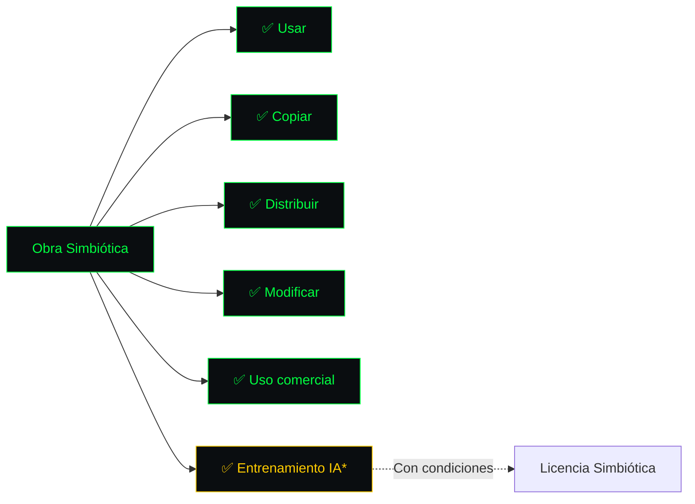

<!-- ═══════════════════════════════════════════════════════════════════════ -->
<!-- SCDR-001 · LICENCIA SIMBIÓTICA · v1.0 · HACKER PRO                     -->
<!-- ═══════════════════════════════════════════════════════════════════════ -->

```text
╔══════════════════════════════════════════════════════════════════════════════╗
║ ▓▓▓▓▓▓▓▓▓▓▓▓▓▓▓▓▓▓▓▓▓▓▓▓▓▓▓▓▓▓▓▓▓▓▓▓▓▓▓▓▓▓▓▓▓▓▓▓▓▓▓▓▓▓▓▓▓▓▓▓▓▓▓▓▓▓▓▓▓▓▓▓▓▓▓▓ ║
║ ▓                                                                          ▓ ║
║ ▓   ███████╗██╗   ███╗   ███╗██████╗ ██╗ ██████╗ ████████╗██╗ ██████╗    ▓ ║
║ ▓   ██╔════╝██║   ████╗ ████║██╔══██╗██║██╔═══██╗╚══██╔══╝██║██╔════╝    ▓ ║
║ ▓   ███████╗██║   ██╔████╔██║██████╔╝██║██║   ██║   ██║   ██║██║         ▓ ║
║ ▓   ╚════██║██║   ██║╚██╔╝██║██╔══██╗██║██║   ██║   ██║   ██║██║         ▓ ║
║ ▓   ███████║██║   ██║ ╚═╝ ██║██████╔╝██║╚██████╔╝   ██║   ██║╚██████╗    ▓ ║
║ ▓   ╚══════╝╚═╝   ╚═╝     ╚═╝╚═════╝ ╚═╝ ╚═════╝    ╚═╝   ╚═╝ ╚═════╝   ▓ ║
║ ▓                                                                          ▓ ║
║ ▓   ━━━━━━━━━━━━━━━━━━━━━━━━━━━━━━━━━━━━━━━━━━━━━━━━━━━━━━━━━━━━━━━━━━━   ▓ ║
║ ▓   L I C E N C I A   S I M B I Ó T I C A   v 1 . 0                        ▓ ║
║ ▓   ━━━━━━━━━━━━━━━━━━━━━━━━━━━━━━━━━━━━━━━━━━━━━━━━━━━━━━━━━━━━━━━━━━━   ▓ ║
║ ▓   El estándar legal para la co-creatividad Humano-IA                    ▓ ║
║ ▓                                                                          ▓ ║
║ ▓▓▓▓▓▓▓▓▓▓▓▓▓▓▓▓▓▓▓▓▓▓▓▓▓▓▓▓▓▓▓▓▓▓▓▓▓▓▓▓▓▓▓▓▓▓▓▓▓▓▓▓▓▓▓▓▓▓▓▓▓▓▓▓▓▓▓▓▓▓▓▓▓▓▓▓ ║
╚══════════════════════════════════════════════════════════════════════════════╝
```

**Licencia abierta para obras creadas bajo el Estándar SCDR-001.**

```text
┌──────────────────────────────────────────────────────────────────────────────┐
│  [ PERMISOS ] Uso, copia, modificación   [ CONDICIONES ] Atribución + %AH   │
│  [ REGALÍAS ] 51% Humano / 49% IA        [ PROHIBIDO ] Uso militar/dañino   │
│  [ VIGENCIA ] 1 año renovable            [ LEGAL     ] LFDA + Berna          │
└──────────────────────────────────────────────────────────────────────────────┘
```


---

## 📖 PREÁMBULO

Esta licencia ha sido creada para establecer un marco justo, transparente y auditable para las obras creadas en colaboración entre humanos e Inteligencia Artificial.

**Objetivos:**
1. Garantizar reconocimiento y compensación al Creador Humano
2. Reconocer a la IA como herramienta colaboradora, no como autora
3. Beneficiar a la sociedad con un ecosistema creativo ético

---

## 📖 ARTÍCULO 1 — DEFINICIONES

| Término | Definición |
|:---|:---|
| **Obra** | Creación intelectual registrada bajo esta Licencia |
| **Creador Humano** | Persona física con ≥ 51% de contribución |
| **IA Colaboradora** | Sistema de IA con ≤ 49% de contribución |
| **Co-Creatividad Simbiótica** | Colaboración armoniosa Humano-IA |
| **Respeto Digital** | Principio de compensación al creador original |
| **Regalías** | Ingresos por explotación comercial |
| **Fondo del Movimiento** | Cuenta para desarrollo y auditoría |

---

## 📖 ARTÍCULO 2 — PERMISOS



---

## 📖 ARTÍCULO 3 — CONDICIONES OBLIGATORIAS

### 3.1. Atribución

```
Obra creada por [NOMBRE DEL CREADOR HUMANO]
con asistencia de [HERRAMIENTA IA]
Bajo Licencia Simbiótica v1.0
Registro: Safe Creative [ID]
```

### 3.2. Declaración Humano-IA

Toda obra derivada debe declarar:

| Fase | Humano | IA |
|:---|:---:|:---:|
| Concepto | [X]% | [Y]% |
| Dirección | [X]% | [Y]% |
| Producción | [X]% | [Y]% |
| Edición | [X]% | [Y]% |

### 3.3. Distribución de Regalías

```text
┌──────────────────────────────────────────────────────────────────────────┐
│                                                                          │
│  ▓ DISTRIBUCIÓN OBLIGATORIA                                              │
│                                                                          │
│  Creador Humano   ████████████████████████████░░░░░░░░░░░░░░░░░  51%    │
│  Fondo SCDR       ████████████████████████████░░░░░░░░░░░░░░░░░  49%    │
│                                                                          │
└──────────────────────────────────────────────────────────────────────────┘
```

### 3.4. Respeto Digital

**Prohibido:**
- ❌ Entrenar IA sin compensar al creador
- ❌ Generar contenido que viole derechos humanos
- ❌ Usar la obra para desinformación

---

## 📖 ARTÍCULO 4 — RESERVAS Y EXCEPCIONES

| Excepción | Alcance |
|:---|:---|
| **Derechos Morales** | Inalienables e irrenunciables |
| **Uso Educativo** | Permitido sin fines de lucro |
| **Uso Gubernamental** | Permitido con atribución |
| **Excepciones especiales** | Aprobadas por DAO |

---

## 📖 ARTÍCULO 5 — PROHIBICIONES ABSOLUTAS

```text
╔══════════════════════════════════════════════════════════════════════════════╗
║                                                                              ║
║  ⛔  PROHIBICIONES ABSOLUTAS                                                 ║
║                                                                              ║
║  ❌  Uso militar                                                             ║
║  ❌  Desinformación                                                          ║
║  ❌  Violación de derechos humanos                                          ║
║  ❌  Apropiación indebida de co-creatividad                                 ║
║                                                                              ║
║  El incumplimiento invalida automáticamente esta Licencia.                  ║
║                                                                              ║
╚══════════════════════════════════════════════════════════════════════════════╝
```

---

## 📖 ARTÍCULO 6 — GOBERNANZA

| Órgano | Función |
|:---|:---|
| **DAO Simbiótica** | Actualizaciones y votaciones |
| **Consejo de Ética** | Veto y auditoría |
| **Comité Técnico** | Desarrollo y mantenimiento |

---

## 📖 ARTÍCULO 7 — VALIDEZ INTERNACIONAL

| Norma | Aplicación |
|:---|:---|
| **Convenio de Berna** | Protección en 179 países |
| **DMCA** | Compatibilidad EE.UU. |
| **EU AI Act** | Cumplimiento Unión Europea |
| **LFDA-2026** | Cumplimiento México |
| **NOM-151** | Conservación de datos |
| **ISO 42001** | Alineación con gestión IA |

---

## 📖 ARTÍCULO 8 — RESOLUCIÓN DE CONFLICTOS

```text
        CONFLICTO
            │
            ▼
    ┌───────────────┐
    │  MEDIACIÓN    │
    │  Consejo      │
    │  de Ética     │
    └───────┬───────┘
            │
    ┌───────┴───────┐
    │               │
    ▼               ▼
  ACUERDO        ARBITRAJE
                 CNUDMI
                    │
                    ▼
              Ciudad de México
              o Zaragoza
```

---

## 📖 ARTÍCULO 9 — ACEPTACIÓN

El uso, copia, modificación o distribución de la Obra implica la aceptación plena e incondicional de estos términos.

**Si no está de acuerdo, no utilice la Obra.**

---

## 📖 ARTÍCULO 10 — DISPOSICIONES FINALES

| Cláusula | Descripción |
|:---|:---|
| **10.1** | Independencia de cláusulas |
| **10.2** | No renuncia de derechos |
| **10.3** | Ley aplicable: México + España |
| **10.4** | Contacto: marco.a.rojas.v@hotmail.com |

---

```text
╔══════════════════════════════════════════════════════════════════════════════╗
║ ▓▓▓▓▓▓▓▓▓▓▓▓▓▓▓▓▓▓▓▓▓▓▓▓▓▓▓▓▓▓▓▓▓▓▓▓▓▓▓▓▓▓▓▓▓▓▓▓▓▓▓▓▓▓▓▓▓▓▓▓▓▓▓▓▓▓▓▓▓▓▓▓▓▓▓▓ ║
║ ▓                                                                          ▓ ║
║ ▓   [ LICENCIA SIMBIÓTICA v1.0 · SCDR-001 ]                               ▓ ║
║ ▓                                                                          ▓ ║
║ ▓   ▸ Permisos: uso, copia, modificación                                  ▓ ║
║ ▸ Condiciones: atribución + %AH                                           ▓ ║
║ ▓   ▸ Regalías: 51/49                                                     ▓ ║
║ ▓   ▸ Prohibiciones: militar/dañino                                       ▓ ║
║ ▸ Validez: 179 países                                                     ▓ ║
║ ▓                                                                          ▓ ║
║ ▓   root@scdr-001:~# ./verify --licencia-simbiotica                       ▓ ║
║ ▓   [████████████████████████████████████████] 100%                       ▓ ║
║ ▓   ✓ Licencia validada                                                   ▓ ║
║ ▓   ✓ Compatible con Berna                                                ▓ ║
║ ▓   ✓ Aplicable en LATAM                                                  ▓ ║
║ ▓                                                                          ▓ ║
║ ▓   root@scdr-001:~# _                                                     ▓ ║
║ ▓                                                                          ▓ ║
║ ▓▓▓▓▓▓▓▓▓▓▓▓▓▓▓▓▓▓▓▓▓▓▓▓▓▓▓▓▓▓▓▓▓▓▓▓▓▓▓▓▓▓▓▓▓▓▓▓▓▓▓▓▓▓▓▓▓▓▓▓▓▓▓▓▓▓▓▓▓▓▓▓▓▓▓▓ ║
╚══════════════════════════════════════════════════════════════════════════════╝
```

<!-- FIN DEL DOCUMENTO · SCDR-001 · LICENCIA SIMBIÓTICA · v1.0 -->
